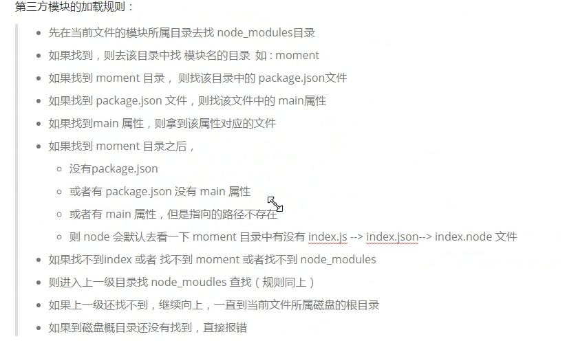

# 概念
	基于Chrome v8引擎的javascript运行环境
	
	既不是一种语言，也不是javascript框架，只是一种运行环境

	Node.js是一种让js运行在服务器端的开发平台，使用事件驱动，异步非阻塞I/O，单线程，跨平台的js运行环境

## 能做什么
	1. web服务器
	
	2. 命令行工具
		
	3. 网络爬虫：按照一定规则，自动抓取网站信息的程序
		
	4. 桌面应用程序开发

## 核心模块
### fs文件模块
### Http模块 搭建一个简易的服务器

### i丢失问题，因为异步的原因 
	异步接收i的时候，i的生命周期已经结束

	使用闭包的方式解决i丢失问题

## 第三方模块
	npm install xx  

	npm 就是nodeJs的一个包管理工具

## package.json文件
	不仅记录的是项目的信息

	还有使用的第三方扩展信息

## 常用应用
	postman  自定义网络连接

## 服务端进行渲染
	使用js模板引擎  art-template
	
	php模板引擎    smarty

## Node自动重启工具 
	nodemon
		命令由 node -> nodemon
		关闭命令 ctrl+c

## commonJs 规范
	node.js对commonJS规范的支持
	
	1. 模块引用 使用require()加载一个模块
	2. 模块定义 模块中使用exports对象导出当前模块数据或者方法  
		module.exports可以直接赋值
		exports只能使用 exports.xxx赋值  exports就是提供的一个变量  exports = module.exports;

		便于理解 示例(伪代码)：
			val module={exports:{}};     exports = obj.jks;    所以module.exports可以直接赋值  exports需要 .变量
		"./"开头 相对路径
		"/"开头 绝对路径

	3. 模块加载规则以及顺序
		寻找顺序看图  

## 模板字符
	${xxx可以做运算}

## 解构赋值
	val arr[a,b,c] = [2,3,5];

	val obj={ name:"lisi", age:23 }
	val [name,age] = obj;

##属性以及方法的简写
	使用一个花括号将已经赋值的变量括起来，就相当于是给一个对象添加一个"变量名：值"的属性
	
	示例：
		val a=89;
		val b = {a};

	先解构再赋值
		val [a,b,c] = [2,3,5];
		val c = {a,b,c};

## promise 容器
	解决回调地狱 

	new promise(function(suc,err){ if(成功) suc(xxx) else err(xxx)})

## 箭头函数( => ) lambda表达式？
	var fun1=function(v1,v2){}  =>

	var fun2 = (v1,v2) => { return v1+v2; } === var fun3 = (v1,v2) => v1+v2;

	形参只有一个时可以省略括号  不过不建议

## express 封装连接功能

## formidable 辅助在nodeJs中的文件上传
 